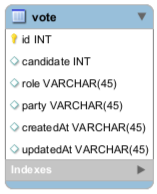

# Sistema de eleições

Esse repositório contém a correção de um exercício construído em aula

## Descrição do exercício
Implementar uma API que possibilite registrar e consultar votos de um processo eleitoral. Duas rotas devem estar disponíveis.

```get /votes```: consultar todos os votos registrados

```post /vote```: registro do voto

Os dados da votação devem ser salvos no Banco de Dados. A estrutura dessa votação é composta da seguinte forma:



### Legenda
- Role: pres, gov, sen, depf, depe.
- Party: pl, pt, mdb…

### Requisitos
- Utilizar TypeScript
- Implementar a API
- Publicar na sua VM
